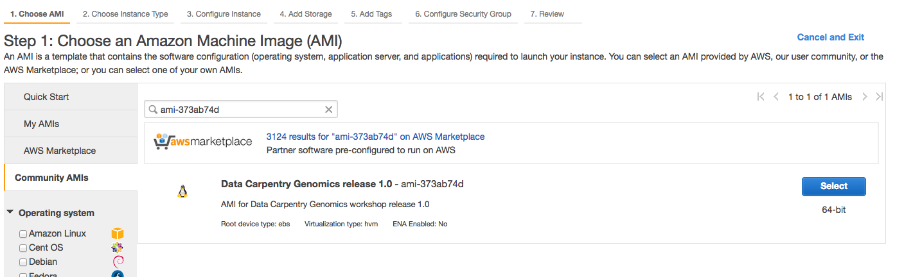
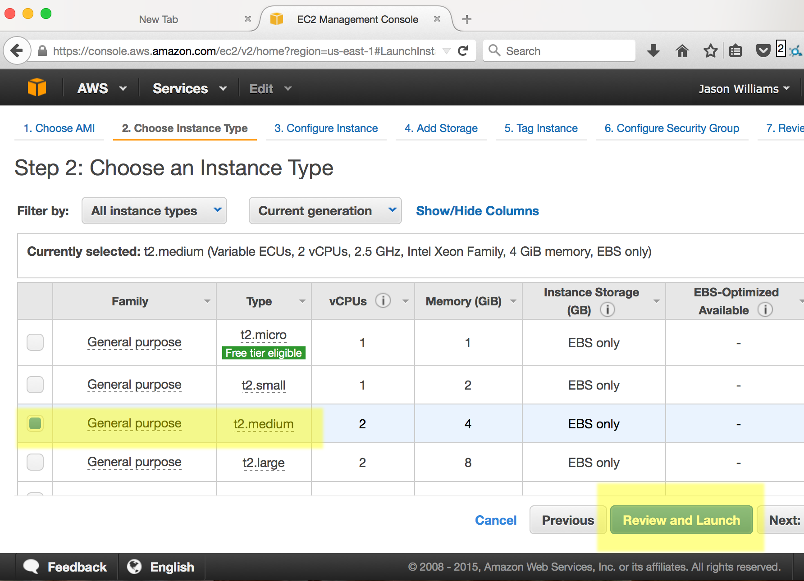

<script language="javascript" type="text/javascript">
function set_page_view_defaults() {
    document.getElementById('div_aws_win').style.display = 'block';
    document.getElementById('div_aws_unix').style.display = 'none';
    document.getElementById('div_cyverse').style.display = 'none';
    document.getElementById('div_hpc').style.display = 'none';
};

function change_content_by_platform(form_control){
    if (!form_control || document.getElementById(form_control).value == 'aws_win') {
        set_page_view_defaults();
    } else if (document.getElementById(form_control).value == 'aws_unix') {
        document.getElementById('div_aws_win').style.display = 'none';
        document.getElementById('div_aws_unix').style.display = 'block';
        document.getElementById('div_hpc').style.display = 'none';
        document.getElementById('div_cyverse').style.display = 'none';
    } else if (document.getElementById(form_control).value == 'cyverse') {
        document.getElementById('div_aws_unix').style.display = 'none';
        document.getElementById('div_cyverse').style.display = 'block';
        document.getElementById('div_hpc').style.display = 'none';
        document.getElementById('div_aws_win').style.display = 'none';
    } else if (document.getElementById(form_control).value == 'hpc') {
        document.getElementById('div_aws_unix').style.display = 'none';
        document.getElementById('div_cyverse').style.display = 'none';
        document.getElementById('div_hpc').style.display = 'block';
        document.getElementById('div_aws_win').style.display = 'none';
    } else {
        alert("Error: Missing platform value for 'change_content_by_platform()' script!");
    }
}

window.onload = set_page_view_defaults;
</script>

## 클라우드 인스턴스 구동시키고 로그인하기

이 문서에는 이번 학습에서 논의 되지 않는 질문과 고급 학습주제를 다루게 된다.

## 클라우드 VM을 스스로 구동시키는 방법

**주요한 주의사항**: 작업단계의 상당수는 이미 강사가 학습자를 위해서 완료해놨다.
스스로 배워보려하거나 워크샵을 마친 후에 시도하고자 하시는 분은 아래 연습문제와 지시사항을 참고하세요.

## 클라우드 선택지

### 상업용 클라우드 (Commercial Clouds)

* [Amazon Web Services](https://docs.aws.amazon.com/AWSEC2/latest/UserGuide/EC2_GetStarted.html)
* [Google Cloud](https://cloud.google.com/compute/docs/quickstart)

### 공개 과학 클라우드 (Open Science Clouds)

* [Atmosphere](https://pods.iplantcollaborative.org/wiki/display/atmman/Getting+Started)
* [JetStream](http://jetstream-cloud.org/)


## 클라우드 인스턴스 (가상 컴퓨터, Virtual Machine) 구동시키기 

*아마존*과 *Atmosphere* 클라우드에서 작업하는 방식이 다음에 나와 있다.
클라우드 플랫폼을 선택하고 지시사항을 따른다.

**클라우드 플랫폼을 선택한다: <select id="id_platform" name="platformlist" onchange="change_content_by_platform('id_platform');return false;"><option value="aws_unix" id="id_aws_unix" selected> AWS_UNIX </option><option value="aws_win" id="id_aws_win" selected> AWS_Windows </option><option value="cyverse" id="id_cyverse"> CyVerse </option><option value="hpc" id="id_hpc"> HPC/HTC cluster </option></select>**


<div id="div_aws_unix" style="display:block" markdown="1">


## AWS (아마존 EC2 인스턴스)

이번 튜토리얼에서 스스로 인스턴스를 구동시키는 법을 시연한다.

이번 워크샵을 벗어나 스스로 분석작업을 수행하거나 본인 데이터를 처리하는데 AWS를 사용하려는 경우,
AWS 본인 계정이 필요하고 이를 통해서 인스턴스를 구동시킬 수 있다.

다음 지시사항을 따라하게 되면 워크샵에서 사용되는 것과 동일한 인스턴스를 구동시킬 수 있게 된다.
이번 튜토리얼이 완전하지는 않지 않고 일부 사소한 차이가 있을 수 있다:

- 아래 4단계에서 불러온 AMI 이미지를 변경시키서 공개적으로 이용가능한 어떤 이미지도 구동시킬 수 있다.
- 전혀 AMI 이미지를 선택하지 않고, 4단계를 건너뛰어서 본인이 지정한 소프트웨어를 설치할 수 있다.
- 다른 자원을 조합하여 인스턴스(더 많은 프로세서, 더 많은 저장공간, 다른 운영체제 등)를 구동시키려면, 5단계에서 다른 선택옵션을 고를 수 있다.
- 더 자세한 지침과 추가 변경사항에 대한 방법은  [EC2 Getting Started](https://docs.aws.amazon.com/AWSEC2/latest/UserGuide/EC2_GetStarted.html) 문서를 참조한다.

> ## 사전 준비물
> 
> * 결재수단(신용카드)
> * 아마존 청구와 지불(Amazon's billing and payment) 이해 
>   (참조: [Getting started with AWS Billing and Cost Management](https://docs.aws.amazon.com/awsaccountbilling/latest/ aboutv2/billing-getting-started.html)) 
> * Amazon Web Services (AWS) 일부를 무료로 사용할 수 있다. 하지만, 무료로 제공되는 서비스로 이번 학습에서 사용되는 데이터를 작업하는데 충분하지 *않을 수도* 있음.
> 
{: .callout}


## AWS에서 인스턴스 구동시키기


### AWS 계정생성

1. Amazon Web Services [https://aws.amazon.com/](https://aws.amazon.com/) 웹사이트로 이동한다.
2. 버튼을 눌러 계정에 가입한다 - 아마존 계약서에 동의해야 하고 신용카드 정보도 넘겨야 한다.


### AWS 로그인하고 인스턴스 구동시키기

1. AWS 로그인한 후 EC2 대쉬보드 이동: [https://console.aws.amazon.com/ec2/](https://console.aws.amazon.com/ec2/)
2. 'Launch Instance' 버튼 클릭

3. '1 단계'에서 좌측편에 "Amazon Machine Image (AMI)"를 선택해서, 'Community AMIs'를 찾아 **ami-373ab74d**"Data Carpentry Genomics release 1.0" 이미지를 선택한다.

4. 'Choose and Instance Type'에서 **t2.medium** 유형을 선택한다; 'Review and Launch'를 클릭한다.
  

    > **팁:** 좀더 큰 인스턴스를 고르게 되면, 비용이 추가로 더 발생된다.
    > 'Review Instance Launch' 단계에서 인스턴스 보안에 대한 경고 메시지도 발생된다.
    > 보안 그룹(security group)에 대한 자세한 내용은 다루지 않는다. 하지만, 인스턴스를 구동시킬 때 반듯이 알아야 되는 사항이다.
    > 그 누구도 악의적으로 본인 인스턴스에 접근하지 못하도록 적절한 방안을 강구해야 한다. 예를 들어 절대 다른 사람에게 보안 자격증명(security credential)을 전달하지 마라. 
    > 신용카드를 건네주는 것과 동일하다.
5. 'Review Instance Launch' 단계 에서 'Launch'를 클릭한다.
7. 키페어(key pari)를 생성하거나, 기존 키페어를 선택하도록 요청을 받게 된다. 'Proceed without a key pair'을 선택하고 나서 `acknowledgement`를 체크하고 'Launch Instances'을 클릭한다.


이제 인스턴스가 구동될 것이다. 'Create billing alerts' 링크를 따라간다.

### 아마존 인스턴스 접속 

1. AWS 로그인한 후 EC2 대쉬보드 이동: [https://console.aws.amazon.com/ec2/](https://console.aws.amazon.com/ec2/)
2. 인스턴스 한개가 보일 것이다. 인스턴스 상태는 'running'으로 보일 것이다. (만약 인스턴스를 방금 구동시켰다면, 3분도 걸리지 않아 인스턴스가 준비된다.)

3. 대쉬보드 하단에 *ec2.12.2.45.678.compute-1.amazonaws.com*와 같이 보이는 **Public DNS**가 보일 것이다. 주소를 복사한다 (인스턴스에 접속할 때마다 필요할 수 있기 때문에 적어두는 것도 좋을 수 있다.)

4. 터미널 응용프로그램을 열고 `ssh` 명령어를 사용해서 접속한다. 접속 명령어는 다음과 같다:

```bash
$ ssh dcuser@your.amazon.dns
```
5. 처음에는 접속하는 컴퓨터에서 호스트 컴퓨터가 진짜인지 확인할 수 없다; **yes**를 입력해서 접속작업을 계속이어 나간다.
6. 그리고 나서 컴퓨터 패스워드를 입력한다:'data4Carp'

이제 AWS EC2 개인 인스턴스에 접속이 되었다.
다음 명령어를 사용해서 접속된 사실을 확인할 수 있다; ``whoami``,``pwd``,``ls`` 명령어를 실행시키면 다음과 같은 결과를 출력한다.

```bash
Last login: Thu Jul 30 13:21:08 2015 from 8.sub-70-197-200.myvzw.com
$ whoami
dcuser
$ pwd
/home/dcuser
$ ls
dc_sample_data	Downloads  openrefine-2.6-beta.1  Trimmomatic-0.32
Desktop		FastQC	   R
$
```

#**매우 중요한 경고 - 원치않게 부과된 요금을 피하는 법**
인스턴스가 실행되는 동안, 사용에 대해 요금이 부과된다.
AWS EC2 대쉬보드의 우측 상단 계정명을 클릭하고 'Billing & Cost Management' 메뉴를 선택하면 현재 부과된 요금을 확인할 수 있다.
**작업이 끝나게 되면 인스턴스를 파기(terminate)시키는 것을 잊지말자.**

## 인스턴스 파기(terminate)

인스턴스로 작업이 완료되면, 파기시켜야 한다. 다음 단계를 따라 인스턴스를 파기한다.

1. AWS 로그인한 후 EC2 대쉬보드 이동: [https://console.aws.amazon.com/ec2/](https://console.aws.amazon.com/ec2/)
2. 'Resources' 아래 'Running Instances'을 선택한다.
3. 파기할 인스턴스를 선택하고 나서, 'Actions' 버튼을 클릭한다.

4. 'Instance State' 아래 파기(terminate)를 선택한다.

    > **경고:** 인스턴스를 파기하게 되면 모든 데이터도 함께 삭제된다. 파기하기 전에 데이터를 다른 곳을 이동시켜야 된다.

    > **팁:** `iCommands`를 사용해서 컴퓨터간, 클라우드 인스턴스, iPlant 데이터 스토어에 저장된 데이터를 이동시킬 수 있다.
    > `iCommands`는 Data Carpentry Amazon AMI에 설치되어 있다.
    > [`iCommands` 도움말](https://pods.iplantcollaborative.org/wiki/display/DS/Using+iCommands)을 참조할 수도 있다.
5. 'Yes, Terminate'를 선택해서 인스턴스를 파기한다.

</div>

<div id="div_aws_win" style="display:block" markdown="1">

**Instructions for PC**


## AWS (Amazon EC2 instances)

In this tutorial, we'll show you how to launch your own instance.

If you want to go through the the genomics lesson outside of a workshop, or if you just want to use
AWS to process your own data, you'll need to have your own account and launch your own instance.

These instructions will help you launch an instance identical to the one we use in workshops, and
and this tutorial is not meant to be exhaustive, but for minor changes:

 - You can launch any publicly available image by changing the AMI that you load in step 4 below.
 - You can choose not to load an AMI at all, and install your own software later by skipping step 4 below.
 - If you want to launch a different set of resources- more processors, more disk space, different operating system, etc;
 you can choose a different option at step 5.
 - For more detailed instructions, and how-tos for other changes consult [EC2 Getting Started](https://docs.aws.amazon.com/AWSEC2/latest/UserGuide/EC2_GetStarted.html)

### Launching an instance on Amazon Web Services

**Prerequisites**

* Form of payment (credit card)*
* Understanding of Amazon's billing and payment (See: [Getting started with AWS Billing and Cost Management](https://docs.aws.amazon.com/awsaccountbilling/latest/aboutv2/billing-getting-started.html))

\* You can use some of Amazon Web Services for free, or see if you qualify for an AWS Grant (See: [https://aws.amazon.com/grants/](https://aws.amazon.com/grants/) ) if you are using AWS for education. The free level of service *will not* be sufficient for working with the amount of data we are using for our lessons.

#### Create an AWS account

1. Go to Amazon Web Services [https://aws.amazon.com/](https://aws.amazon.com/)
2. Follow the button to sign up for an account - you will need to agree to Amazon's terms and conditions and provide credit card information.


#### Sign into AWS and Launch an Instance

1. Sign into AWS EC2 Dashboard: [https://console.aws.amazon.com/ec2/](https://console.aws.amazon.com/ec2/)

2. Click the 'Launch Instance' button  
  
  
3. In 'Step 1' you will be asked to choose an Amazon Machine Image (AMI), on the lefthand side, look for 'Community AMIs' and then search for **ami-373ab74d**; select this image  


4. For 'Choose and Instance Type' select **t2.medium**  
    
  > **Tip:** You can select larger instances, but these will cost more to run.
  > Also for the 'Review Instance Launch' you will get some warning about
  > instance security. We will not go into detail here about security groups.
  > However, you should know that when you launch an instance, you will want to
  > take steps to make sure no one maliciously accesses your instance. For
  > example, never give your security credentials (next step) to another user.  
  
5. Click on "6. Configure Security Group" in the top navigation menu. Choose
   "select an existing security group" under "assign a security group", and
   choose "sg-a5dba9ef" which has the name "to use with DC genomics AMI".

5. Click "Review and Launch" and the bottom of the screen, and then click
   'Launch'

6. You will be asked to Select an existing key pair or create a new key pair.  Select 'Proceed without a key pair' and select the acknowledgement you are given. Then click 'Launch Instances'.


You instance will now be launched. You should follow the links to 'Create billing alerts'.

#### Connecting to your Amazon Instance

1. Download the PuTTY application at: [http://the.earth.li/~sgtatham/putty/latest/x86/putty.exe](http://the.earth.li/~sgtatham/putty/latest/x86/putty.exe)

1. Log into your AWC EC2 Dashboard [https://console.aws.amazon.com/ec2/](https://console.aws.amazon.com/ec2/)

2. You should see that you have one instance, make sure instance state is 'running' (if you just launched the instance it will take <5 min for the instance to start running)  


3. At the bottom of the dashboard, you should see a **Public DNS** which will look something like *ec2.12.2.45.678.compute-1.amazonaws.com*. Copy that address (you may wish make a note of it as you will need this each time you connect.)  


4. Start PuTTY. In the section 'Specify the destination you want to connect to' for 'Host Name (or IP address)' paste in the DNS address and click 'Open'

5. When prompted to login as, enter 'dcuser'; you may be notified that the authenticity of the host cannot be verified - if so, ignore the warning an continue connecting

6. When prompted for a password enter 'data4Carp'

You should now be connected to your personal instance. You can confirm this with the following commands; ``whoami``,``pwd``,``ls``, which should yield the following results:

```bash
Last login: Thu Jul 30 13:21:08 2015 from 8.sub-70-197-200.myvzw.com
$ whoami
dcuser
$ pwd
/home/dcuser
$ ls
dc_sample_data	Downloads  openrefine-2.6-beta.1  Trimmomatic-0.32
Desktop		FastQC	   R
$
```


#**Very Important Warning - Avoid Unwanted Charges**
Please remember, for as long as this instance is running, you will be charged for your usage. You can see an estimate of the current charge from your AWS EC2 dashboard by clicking your name (Account name) on the upper right of the dashboard and selecting 'Billing & Cost Management'. **DO NOT FORGET TO TERMINATE YOUR INSTANCE WHEN YOU ARE DONE**

### Terminating your instance

When you are finished with your instance, you must terminate. Follow the following steps.

1. Sign into AWS and go to the EC2 Dashboard: [https://console.aws.amazon.com/ec2/](https://console.aws.amazon.com/ec2/)
2. Under 'Resources' select 'Running Instances'
3. Select the instance you wish to terminate, then click 'Actions'  

4. Under 'Instance State' select terminate.

    > **Warning:** This will delete any data on this instance, so you must move any data you wish to save off the instance.

    >  **Tip:** You can use iCommands to move data between your computer, a cloud instance, and the iPlant Data Store. iCommands is installed on the Data Carpentry Amazon AMI. You can download and see documentation for iCommands [here](https://pods.iplantcollaborative.org/wiki/display/DS/Using+iCommands) - there is also some documentation on setting up iCommands in the Atmosphere section below
5. Select 'Yes, Terminate' to terminate the instance.

</div>

<div id="div_cyverse" style="display:block" markdown="1">

## Launching an instance on Atmosphere - These instructions are in beta and not fully tested!

**Prerequisites**

* You must have an iPlant account (register at [https://user.cyverse.org/](https://user.cyverse.org/) ) - You must also request access to Atmosphere (see [documentation](https://wiki.cyverse.org/wiki/display/atmman/Atmosphere+Manual+Table+of+Contents) **CyVerse requires Atmosphere users to have a valid .edu or .org email address** )

#### Sign into Atmosphere and launch an instance
1. Sign into Atmosphere at: [http://atmo.iplantcollaborative.org/](http://atmo.iplantcollaborative.org/)
2. Select 'Launch New Instance'
    
3. Search for the 'TSW Workshop Williams 1.2' image; Select this image.
    
4. Click Launch and then select the following options in the launch wizard:
    
    - Instance Name:Enter a name(optional)
    - Base Image Version: 1.0
    - Project: Choose an existing or create a new project.
    - Provider: iPlant Cloud - Tucson
    - Instance Size: small2
Click Launch.

    > **Tip:** You can select a larger instance, but you must have sufficient resources (no exceeded quotas). If Atmosphere is at high capacity, you may not be able to launch an instance if the instance size exceeds what is currently free on the cloud provider

Your instance should be ready in 10-15 minutes. When your instance status is listed as 'active' you will be able to connect.


#### Connect to Atmosphere instance

**Instructions for Mac\Linux**

1. If necessary, log into your Atmosphere at: [https://atmo.iplantcollaborative.org/application/images](https://atmo.iplantcollaborative.org/application/images)
2. Click on 'Projects' and select the project that contains your instance.
3. Verifying that your instance status is **'active'**, copy the IP address (e.g. 128.123.12.34) to your clipboard.
    
3. Open the terminal application  and use 'ssh' to connect. Your command will be:

    ```bash
$ ssh iplantusername@your.atmosphere.ipaddress
```
5. Your computer will be unable to verify the authenticity of the host... type **yes** to continue connecting
6. When prompted for a password, enter your iPlant username.

You should now be connected to your personal instance. You can confirm this with the following commands; ``whoami``,``pwd``, which should yield the following results:

```bash
Welcome to Ubuntu 12.04.2 LTS (GNU/Linux 3.2.0-37-virtual x86_64)

New release '14.04.2 LTS' available.
Run 'do-release-upgrade' to upgrade to it.

    _   _                             _
   / \ | |_ _ __ ___   ___  ___ _ __ | |__   ___ _ __ ___
  / _ \| __| '_ ` _ \ / _ \/ __| '_ \| '_ \ / _ \ '__/ _ \
 / ___ \ |_| | | | | | (_) \__ \ |_) | | | |  __/ | |  __/
/_/   \_\__|_| |_| |_|\___/|___/ .__/|_| |_|\___|_|  \___|
                               |_|

iPlant Collaborative

The user manual is located here: http://goo.gl/2pT72
For assistance, contact support@iplantcollaborative.org.  

Last login: Fri Aug 14 10:16:50 2015 from dhcp140-78.cshl.edu
iplantusername@vm65-164:~$ whoami
iplantusername
iplantusername@vm65-164:~$ pwd
/home/iplantusername
```
**Note**: In the above example 'iplantusername' will be your actual iPlant username.

**Instructions for PC**

1. Download the PuTTY application at: [http://the.earth.li/~sgtatham/putty/latest/x86/putty.exe](http://the.earth.li/~sgtatham/putty/latest/x86/putty.exe)
2. If necessary, log into your Atmosphere at: [http://atmo.iplantcollaborative.org/](http://atmo.iplantcollaborative.org/)
3. Click on 'Projects' and select the project that contains your instance.
4. Verifying that your instance status is **'active'**, copy the IP address (e.g. 128.123.12.34) to your clipboard.
   
5. Start PuTTY. In the section 'Specify the destination you want to connect to' for 'Host Name (or IP address)' paste in the DNS address and click 'Open'
6. When prompted to login as, enter your iPlant username; you may be notified that the authenticity of the host cannot be verified - if so, ignore the warning an continue connecting
7. When prompted for a password enter your iPlant password.

You should now be connected to your personal instance. You can confirm this with the following commands; ``whoami``,``pwd``, which should yield the following results:

```bash
Welcome to Ubuntu 12.04.2 LTS (GNU/Linux 3.2.0-37-virtual x86_64)

New release '14.04.2 LTS' available.
Run 'do-release-upgrade' to upgrade to it.

    _   _                             _
   / \ | |_ _ __ ___   ___  ___ _ __ | |__   ___ _ __ ___
  / _ \| __| '_ ` _ \ / _ \/ __| '_ \| '_ \ / _ \ '__/ _ \
 / ___ \ |_| | | | | | (_) \__ \ |_) | | | |  __/ | |  __/
/_/   \_\__|_| |_| |_|\___/|___/ .__/|_| |_|\___|_|  \___|
                               |_|

iPlant Collaborative

The user manual is located here: http://goo.gl/2pT72
For assistance, contact support@iplantcollaborative.org.  

Last login: Fri Aug 14 10:16:50 2015 from dhcp140-78.cshl.edu
iplantusername@vm65-164:~$ whoami
iplantusername
iplantusername@vm65-164:~$ pwd
/home/iplantusername
```
**Note**: In the above example 'iplantusername' will be your actual CyVerse username.


#### Bringing sample data into your Atmosphere instance

The sample dataset is **NOT** included on the Atmosphere instance. The very first time you load the instance, you will need to copy data from the public CyVerse Data Store into your instance using the following instructions.

## Setup iCommands

**Prerequisites**
* You must be connected to your Atmosphere instance

iCommands will allow you to quickly transfer data into your Atmosphere instance:

1. Initialize iCommands using the following command

    ```bash
$ iinit
```
2. You will then be asked to setup your account and will need to enter the following information

    |Prompt|Entry|
|------|-----|
|irodsHost|data.iplantcollaborative.org|
|port|1247|
|zone|iplant|
|irodsUserName|your iplant username|
|Current iRODS password|your iplant password|
3. Verify that you have connected to your iPlant Data Store; view the contents of your home directory using the following the ``ils`` command:

    ```bash
$ ils
```
## Copy Sample Data to your instance

1. Enter the following command:

    ```bash
$ iget -rPVT /iplant/home/shared/iplant_training/data_carpentry_ngs/dc_sampledata_lite .
```
2. using ``ls`` you should be able to verify you have downloaded the dc_sampledata_lite directories and files.


> **Tip**: You can use iCommands to move data between your computer, a cloud instance, and the CyVerse Data Store. iCommands is installed on the Data Carpentry Amazon AMI. You can download and see documentation for iCommands [here](https://pods.iplantcollaborative.org/wiki/display/DS/Using+iCommands)

### Terminating your Atmosphere instance

When you are finished with your instance, you must terminate. Follow the following steps.

1. If necessary, sign into Atmosphere: [http://atmo.iplantcollaborative.org/](http://atmo.iplantcollaborative.org/)
2. Locate your instance (e.g. select 'Projects' and then select the project that contains the instance you will terminate.)
3. Click on the instance name to get to the 'Actions' menu. You may then select the 'Delete' button to terminate the instance.  

    > **Warning:** This will delete any data on this instance, so you must move any data you wish to save off the instance (for example by using iCommands).
5. After reading the warning and confirming you are ready, click 'Terminate' to terminate the instance.

</div>
