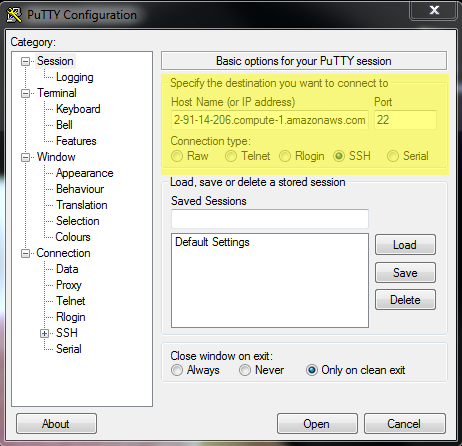

## 중요한 사항

이번 학습은 *이미 돌고 있는* 아마존 인스턴스에 대해 로그인하고 로그아웃하는 방법을 다룬다.

## AWS 배경 지식

신규 AWS 인스턴스를 설정하려면 AWS 계정, 신용카드가 필요한데 최대 1일까지 검증시간이 소요된다.
하지만, 여러분은 이미 워크샵의 상당시간을 클라우드에서 보내고 있습니다!
시간을 절약하고자, 강사가 원격 컴퓨터(인스턴스)를 워크샵 전에 구동시켜놨고, 학습 데이터도 전달되어 있다.
명령라인 인터페이스에 좀더 친숙해졌기 때문에, EC2 인스턴스로 들어가서 작동법을 더 알아보자.

We have a pre-configured copy of the data needed for this workshop that is always available
to attach to a new instance on Amazon, as long as you have an account, and the log-in credentials to open it.

워크샵을 위해서 필요한 데이터도 준비된 컴퓨터가 사전에 환경설정을 마무리한 채 AWS에 준비되어 있다.
아마존 신규 인스턴스에 접근하려면 계정과 로그인 자격증명(credential)을 준비하면 된다.

EC2 인스턴스의 워크샵 데이터에 접근하려면, 로그인 자격증명(사용자명과 비밀번호)을 사용한다:

**로그인 자격증명(Log-in Credentials)**

- Username: dcuser
- Password: data4Carp

하지만, 워크샵 데이터에 접근할 수 있는 인스턴스를 찾으려면 로그인할 장소(컴퓨터)를 찾아야 한다.
우선, IP 주소가 필요하다. 아마도 강사가 워크샵 시작전에 IP 주소를 전달했을 것이다.

IP 주소(IP address)는 웹주소(www.amazon.com)와 같은 웹주소의 숫자 버젼이라고 보면 된다.
숫자 주소는 사람이 기억하기 어려워 이에 대응되는 사람이 기억하기 편한 웹주소가 흔히 사용된다.

클라우드 컴퓨팅은 선택에 관한 것이라는 점을 상기한다.
소규모 프로젝트를 위해서 프로세스 한개만 갖는 컴퓨터를 임대한다.
대규모 프로젝틀르 위해서는 수십대의 컴퓨터가 네트워크로 엮인 프로세스 수백개를 임대한다.
어떤 경우가 되었건 관계없이 프로세스를 임대하게 되면, 
마치 컴퓨터 한대인 것인양 빌린 컴퓨터를 아마존이 제시해 준다.
따라서, 인스턴스가 호스트된 물리적 컴퓨터는 어디 다른 곳으로 이동하지 않지만, 
매번 신규 인스턴스를 구동시킬 때마다, 신규 IP가 인스턴스에 부여된다.

결론적으로 매번 신규 인스턴스를 구동시키게 되면,
**IP 주소**는 바뀌지만, **로그인 자격증명(사용자명과 비밀번호)**은 바뀌지 않는다.

## 접속 프로토콜Protocols)

시큐어 쉘(Secure Shell, SSH)라는 프로토콜을 접속하는데 사용한다.
이를 통해서 [유닉스 쉘(shell)](http://statkclee.github.io/shell-novice-kr)을 사용하는 보안이 강화된 안전한 방법이 제공된다.
이번 경우에 쉘은 원격 컴퓨터에서 구동되고 있게 된다.
SSH 프로토콜은 모든 운영체제에서 지원되지만, 경우에 따라서 부가적인 소프트웨어를 설치할 필요도 있다.

## 클라우드 인스턴스에 로그인하기

**클라우드 플랫폼을 선택한다: <select id="id_platform" name="platformlist" onchange="change_content_by_platform('id_platform');return false;"><option value="aws_unix" id="id_aws_unix" selected> AWS_UNIX </option><option value="aws_win" id="id_aws_win" selected> AWS_Windows </option></select>**

#### PC를 사용해서 접속

**사전 준비물**: SSH 클라이언트가 구비되어 있어야 한다.
무료로 이용할 수 있는 선택지가 다수 있지만, 
워크샵 시작할 때 [PuTTY.exe](http://www.chiark.greenend.org.uk/~sgtatham/putty/download.html)를 설치했다.
이를 계속 사용하기로 한다.

1. PuTTY를 연다.
2. 'Host Name (or IP address)' 섹션에 강사가 전달한 IP주소(혹은 본인이 준비한 인스턴스의 IP 주소)를 붙여넣는다. 

    *`SSH' and Port (22)` 섹션은 기본 디폴트 설정 그대로 둔다.**

    

3. 'Open' 버튼을 클릭한다.
    
    경고 메시지가 제시된다.

    

3. 'Yes'를 눌러 연결을 계속 진행시킨다.
4. 마지막 단계로, 로그인을 위해서 사용자명과 비밀번호를 입력한다.
    
    **주목:** 비밀번호를 타이핑할 때, 별표(예를 들어, `****`), 혹은 커서가 이동하는 것을 전혀 볼 수 없지만 유닉스/리눅스에서는 흔한 일이다.
    비밀번호 입력을 계속해 나간다.
    
    

이제 EC2 인스턴스에 접속되어야만 된다!

#### 맥/리눅스를 이용하여 접속하기

맥과 리눅스 운영체제에는 터미널이 이미 설치되어 있다.

1. 터미널을 연다.

    'Terminal'을 찾거나 터미널 아이콘을 클릭한다.

    

2. 강사가 전달한 IP주소(혹은 본인이 준비한 인스턴스의 IP 주소)를 다음 명령어(`ssh`) 뒤 `ip_address`에 타이핑한다.

    ~~~
    $ ssh dcuser@ip_address
    ~~~
    {: .bash}

    *대소문자와 공백에 특히 주의를 기울인다.* 

3. 아래와 같은 보안 메시지가 나올 것이다.

    ~~~
    The authenticity of host 'ec2-52-91-14-206.compute-1.amazonaws.com (52.91.14.206)' can't be established.
    ECDSA key fingerprint is SHA256:S2mMV8mCThjJHm0sUmK2iOE5DBqs8HiJr6pL3x/XxkI.
    Are you sure you want to continue connecting (yes/no)?
    ~~~
    {: .bash}

4. `yes`를 타이핑해서 계속 진행시킨다.
5. 마지막 단계로, 로그인을 위해서 사용자명과 비밀번호를 입력한다.
    
    **주목:** 비밀번호를 타이핑할 때, 별표(예를 들어, `****`), 혹은 커서가 이동하는 것을 전혀 볼 수 없지만 유닉스/리눅스에서는 흔한 일이다.
    비밀번호 입력을 계속해 나간다.
    
이제 EC2 인스턴스에 접속되어야만 된다!

## 클라우드 인스턴스 로그오프하기

인스턴스를 로그오프하는 것은 본인 소유 로컬 컴퓨터에서 로그오프하는 것과 매우 유사하다:
현재 실행되는 모든 프로세스를 중지시키기는 하지만, 컴퓨터를 끄지는 않는다.
인스턴스에서 로그오프하더라도 인스턴스가 돌아가기만 하면 AWS 청구 비용은 계속해서 쌓여간다.

AWS 인스턴스로 작업이 *완전히* 마무리되면, 로그오프한 다음에 인스턴스를 필히 **파기(terminate)**시킨다.
인스턴스를 파기하는 절차는 [스스로 인스턴스 구동시키기](../02-launching-instances/)를 참조한다.

로그오프하려면, 인스턴스와 연결된 터미널에서 `exit` 명령어를 사용한다.
`exit` 명령어는 연결을 종료시키는 역할을 한 후, 터미널을 다시 로컬 컴퓨터로 되돌리는 역할을 한다: 

~~~
dcuser@ip-172-31-62-209 $ exit

Amandas-MacBook-Pro-3 $
~~~
{: .bash}

## 다시 로그인하기

인터넷 연결이 느리거나 불안정할 수 있다. 인터넷을 사용하는 경우, 웹페이지 새로 고치기나 
그림 파일이 로딩될 때 다소 시간이 걸려 대기하는 것에 대응된다.
클라우드에서 작업할 때, 예기치않게 인스턴스에서 튕겨 갑자기 연결이 끊어질 수 있다.
가장 좋은 인터넷 연결 서비스를 제공받을 때 조차도, 송수신 신호가 누락되기도 한다.
상기 SSH 단계을 숙지하게 되면, 매번 접속절차를 하나씩 따라할 필요없이 AWS EC2 인스턴스에 로그인할 수 있게 된다.

다음 섹션에서, 인스턴스 연결이 끊어지더라도 프로세스를 계속 살릴 수 있게 해주는 프로그램을 배울 것이다.
현재로, 로그인과 로그오프를 몇차례 실습하면 충분하다.
